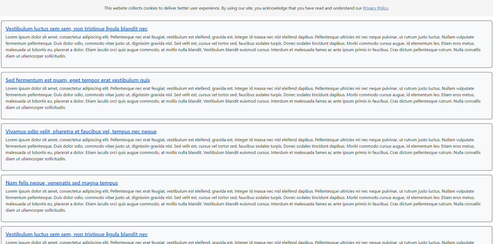

# PHP / Laravel Web Project

This project is a web application that allows users to view articles, categorized by different categories and tagged with relevant tags. Users can browse articles, search for specific articles, and access legal information such as Terms of Use and Privacy Policy.

## Features
- Home page displaying the latest 5 articles with titles and a brief excerpt.
- Article view page displaying the full content, creation date, category, and tags of a selected article.
- Category view page listing all articles of a specific category.
- Tag view page listing all articles associated with a particular tag.
- Proper error handling for non-existent categories and graceful handling of requested slugs.
- Search page with search bars for article ID, category, and tag, redirecting to the respective pages.
- Cookie notice displayed on every page.
- Footer displayed on all web pages with links to the search page and legal page, along with a copyright notice.

## Usage
- Clone the repository.
- Navigate to the project via a terminal and type `php artisan serve`.

## Screenshots

*Screenshot 1: Example page*
